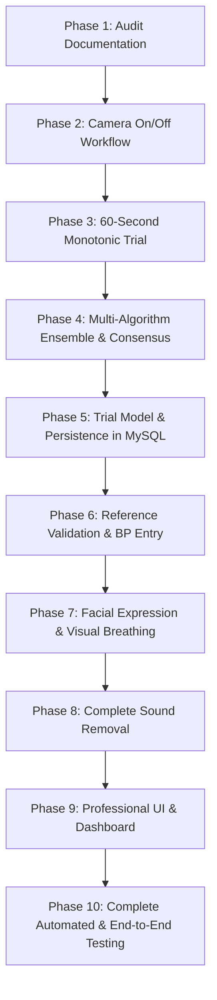

# PulseVision 3.0: Repair & Reconstruction Execution Plan

This document defines the 10-phase repair roadmap to bring PulseVision into complete compliance with the Version 3.0 specification.

---

## Roadmap Overview

---

## Detailed Execution Steps

### Phase 1: Audit Documentation
- Generate `docs/PROJECT_AUDIT.md`, `docs/FEATURE_STATUS.md`, `docs/REPAIR_PLAN.md`.
- Establish benchmark baseline before code alterations.

### Phase 2: Camera On/Off Control
- Implement explicit Camera OFF standby view in UI.
- Provide "Turn Camera On" and "Stop Camera" controls.
- Ensure camera shutdown stops all media tracks, cancels running loops, and cancels incomplete trials.

### Phase 3: 60-Second Monotonic Trial
- Set scan duration to 60.0 seconds using monotonic `performance.now()`.
- Display countdown ($60 \to 0\text{s}$), elapsed time, total frames, usable frames, and live SQI.
- Early cancellation locks the final BPM display and registers the trial as `CANCELLED`.
- Full 60s scans with SQI $< 0.25$ or SNR $< -2.0\text{ dB}$ are registered as `REJECTED`.

### Phase 4: Multi-Algorithm Ensemble & Consensus Engine
- Implement FastICA rPPG in `backend/app/signal_processing/ica.py`.
- Implement `MultiAlgorithmConsensus` in `backend/app/signal_processing/consensus.py`.
- Run POS, CHROM, GREEN, FastICA, and TS-CAN on the identical temporal RGB window.
- Calculate median of valid estimates; flag `UNRELIABLE` if algorithm spread $> 12\text{ BPM}$.
- Add endpoint `POST /api/inference/ensemble`.

### Phase 5: Trial Lifecycle & Database Persistence
- Implement `Trial` model in `backend/app/models/trial.py` with `trial_uid`, status, duration, ensemble JSON, consensus result, and reference data.
- Implement endpoints `POST /api/trials/create`, `POST /api/trials/{id}/complete`, `POST /api/trials/{id}/cancel`, `GET /api/trials`.
- Wire the UI "+ New Trial" button to open the trial creation form and initialize the session.

### Phase 6: Reference Devices & Manual Blood Pressure Entry
- Completely purge all fake smartwatch references and animated mock lines.
- Add manual Blood Pressure Reference Entry form (Systolic: 90–200 mmHg, Diastolic: 50–130 mmHg).
- Clearly label: "Manual Reference Measurement - Not an automatic webcam measurement".
- Update device graphs to render "No device measurements available" when empty.

### Phase 7: Facial Expression & Visual Breathing-Rate Estimation
- Implement visual breathing-rate estimator in `backend/app/signal_processing/respiratory.py` ($0.1\text{--}0.5\text{ Hz}$ bandpass on chin/nasal vertical motion).
- Implement geometric facial expression estimator (Neutral, Happy, Surprised, Frowning) labeled strictly as experimental.
- Integrate into live scan frame summary and final trial reports.

### Phase 8: Complete Sound Removal
- Remove `#btn-toggle-audio` and cardiac synthesizer elements from `frontend/index.html`.
- Remove Web Audio API synthesizer (`AudioContext`) and heartbeat pacer from `frontend/js/app.js`.
- Guarantee 100% silent visual operation.

### Phase 9: UI & Dashboard Refinement
- Improve visual dashboard, trial history log, real-time waveform oscilloscope, and clinical report downloads.
- Ensure state persistence across page refreshes.

### Phase 10: Complete Testing & Verification
- Add comprehensive pytest suites covering camera lifecycle, 60s window, multi-algorithm consensus, trial persistence, and breathing rate.
- Run complete test suite and report real pass/fail results.
