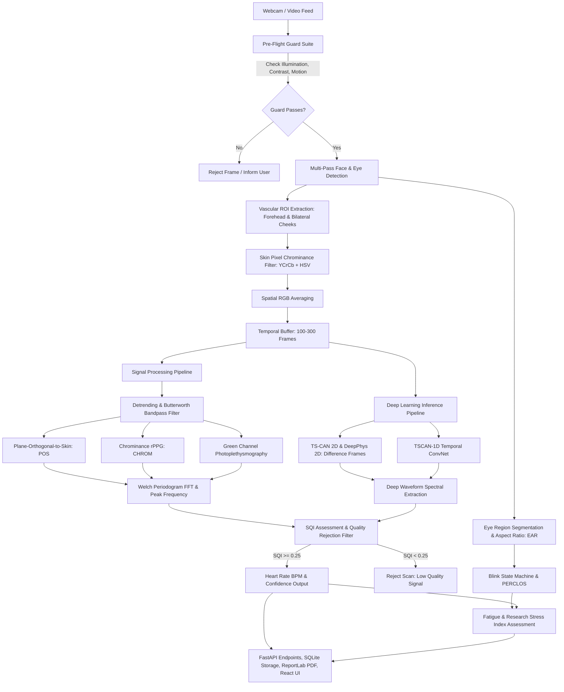

# PulseVision AI Architecture & Engineering Specification

## 1. System Overview

PulseVision is a full-stack research platform for contactless photoplethysmography (rPPG). It captures facial video through a standard webcam or video stream, isolates vascular micro-blushes in skin tissue caused by cardiac pulse waves, and extracts physiological parameters including:
- Pulse Rate / Beats Per Minute (BPM)
- Signal Quality Index (SQI) and Signal-to-Noise Ratio (SNR)
- Eye Aspect Ratio (EAR), Blink Dynamics, and PERCLOS
- Autonomous Nervous System (ANS) Stress Proxy

---

## 2. Computer Vision & Pre-Flight Quality Guards

### 2.1 Pre-Flight Quality Guards (`preflight_guards.py`)
To prevent signal distortion and hallucinated estimates, every frame undergoes rigorous pre-flight checks:
1. **Luminance Check**: Ensures mean grayscale value is between $40$ and $220$. Values below $40$ indicate underexposure; values above $220$ indicate camera sensor saturation.
2. **Contrast Check**: Grayscale standard deviation must exceed $15.0$ to ensure sufficient spatial dynamics.
3. **Centering & Bounding Check**: The detected face must occupy at least $10\%$ and no more than $85\%$ of the frame width, centered within the camera view.
4. **Motion & Stability Guard**: Frame-to-frame optical displacement using root-mean-square intensity difference must remain below the motion threshold ($25.0$). Excessive head translation invalidates the micro-pulse signal.

### 2.2 Vascular Region of Interest (ROI) Extraction (`roi_extractor.py`)
Micro-capillary pulsatile blood volume changes are strongest in regions with minimal facial muscle articulation and thin epidermal layers:
- **Forehead ROI**: The upper $25\%$ of the face bounding box, inset horizontally by $20\%$ on each side to avoid hair interference.
- **Bilateral Cheek ROIs**: Left and right mid-face regions ($35\%\text{--}65\%$ height, $10\%\text{--}40\%$ and $60\%\text{--}90\%$ width) avoiding lips, mouth movement, and nostrils.
- **Skin Chrominance Mask**: Skin pixels are validated using dual-color space thresholds:
  - $YCrCb$: $Y \in [0, 255]$, $Cr \in [133, 173]$, $Cb \in [77, 127]$
  - $HSV$: $H \in [0, 50]$, $S \in [0.15, 0.70]$, $V \in [0.20, 0.95]$

---

## 3. Signal Processing & rPPG Algorithms

### 3.1 Temporal Filtering & Detrending (`filter.py`)
- **Smoothness Priors Detrending**: Removes low-frequency baseline drift caused by respiration, minor posture shifts, and sensor warming ($\lambda = 100$).
- **Butterworth Bandpass Filter**: 4th-order zero-phase forward-backward filter with passband $[0.75\text{ Hz}, 2.5\text{ Hz}]$, corresponding to human physiological cardiac limits of $45\text{ BPM}$ to $150\text{ BPM}$.

### 3.2 Plane-Orthogonal-to-Skin (POS) Algorithm (`pos.py`)
Developed by Wang et al. (IEEE TBME 2017), POS defines a projection plane orthogonal to the skin tone vector in normalized RGB space:
1. Temporal normalization: $C_n(t) = \frac{C(t)}{\bar{C}} - 1$, where $C = [R, G, B]^T$.
2. Projection axes:
   $$S_1(t) = G_n(t) - B_n(t)$$
   $$S_2(t) = -2 R_n(t) + G_n(t) + B_n(t)$$
3. Alpha tuning using ratio of standard deviations:
   $$\alpha = \frac{\sigma(S_1)}{\sigma(S_2)}$$
   $$H(t) = S_1(t) + \alpha S_2(t)$$

### 3.3 Chrominance-Based rPPG (CHROM) (`chrom.py`)
Developed by de Haan & Jeanne (IEEE TBME 2013), CHROM eliminates specular reflection by constructing two orthogonal chrominance signals:
$$X_s = 3 R_n - 2 G_n$$
$$Y_s = 1.5 R_n + G_n - 1.5 B_n$$
$$S = X_s - \alpha Y_s, \quad \alpha = \frac{\sigma(X_s)}{\sigma(Y_s)}$$

### 3.4 Green Channel PPG (`green.py`)
Oxygenated hemoglobin ($HbO_2$) has peak optical absorption in the green spectrum ($\approx 540\text{--}575\text{ nm}$). Spatial averaging over verified skin pixels isolates the pulsatile signal directly.

### 3.5 Spectral Analysis & Signal Quality Index (`spectral.py`)
- **Welch Periodogram**: Estimates power spectral density (PSD) with 50% overlapping Hanning windows.
- **Heart Rate Peak Extraction**:
  $$f_{\text{peak}} = \arg\max_{f \in [0.75, 2.5]} P(f)$$
  $$\text{BPM} = f_{\text{peak}} \times 60$$
- **Signal-to-Noise Ratio (SNR)**:
  $$\text{SNR}_{\text{dB}} = 10 \log_{10}\left( \frac{\int_{f_{\text{peak}} - \delta}^{f_{\text{peak}} + \delta} P(f)\,df}{\int_{0.75}^{2.5} P(f)\,df - \int_{f_{\text{peak}} - \delta}^{f_{\text{peak}} + \delta} P(f)\,df} \right)$$
- **Quality Rejection Guard**: If $\text{SNR} < -6.0\text{ dB}$ or $\text{SQI} < 0.25$, the estimate is explicitly **rejected** (`accepted: false`). PulseVision never invents or fabricates vital signs.

---

## 4. Deep Learning Architecture (`backend/app/ml/`)

| Model | Checkpoint File | Parameters / Size | Architecture Description |
|---|---|---|---|
| **TSCAN-2D** | `final_model_release/PURE_TSCAN.pth` | 8.5 MB | Temporal Shift Convolutional Attention Network operating on spatial difference frames ($\Delta S_t, S_t$). Uses 2D spatial convolutions with temporal channel shifts. |
| **DeepPhys-2D** | `final_model_release/PURE_DeepPhys.pth` | 8.5 MB | Two-branch Convolutional Neural Network with Motion and Appearance branches joined by spatial attention masks. |
| **TSCAN-1D** | `backend/models/rppg_tscan_best.pth` | 178 KB | Lightweight 1D Temporal Convolutional Network operating on 3-channel mean skin color signals ($R, G, B$) for real-time edge CPU inference. |

---

## 5. Fatigue & Stress Analysis (`fatigue_stress/analyzer.py`)

1. **Eye Aspect Ratio (EAR)**:
   Calculates ratio of vertical eye opening to horizontal eye width:
   $$\text{EAR} = \frac{\|p_2 - p_6\| + \|p_3 - p_5\|}{2 \|p_1 - p_4\|}$$
2. **Blink Detection & PERCLOS**:
   - Blink threshold: $\text{EAR} < 0.21$.
   - PERCLOS: Percentage of time eyes remain $>80\%$ closed over a sliding 60-second window.
   - Classification: Alert ($<12\%$), Mild Fatigue ($12\%\text{--}25\%$), Drowsy / Fatigued ($>25\%$).
3. **Research Stress Index**:
   Calculates a non-diagnostic stress proxy from high-frequency pulse stability combined with blink frequency jitter:
   $$\text{Stress Score} = \text{clamp}\left( 0.4 \times \text{BPM Norm} + 0.35 \times \text{Blink Rate Norm} + 0.25 \times (1 - \text{SQI}), 0, 100 \right)$$

---

## 6. Database Schema & Persistence (`backend/app/models/`)

The SQLite database (`pulsevision.db`) implements six structured tables:
1. `users`: ID, name, email, hashed_password, phone, created_at, updated_at.
2. `scans`: ID, user_id, started_at, completed_at, duration_seconds, sampling_rate, algorithm_name, model_version, estimated_bpm, confidence, signal_quality, accepted, rejection_reason, classification, stress_level, fatigue_level, ear_value.
3. `validation_trials`: ID, user_id, trial_name, participant_code, reference_source, condition, lighting_condition, movement_condition, reference_bpm, pulsevision_bpm, absolute_error, algorithm, signal_quality, notes, timestamp.
4. `reports`: ID, user_id, scan_id, file_path, file_size, summary_text, created_at.
5. `sms_logs`: ID, user_id, phone_number, message_preview, status, twilio_sid, created_at.
6. `email_logs`: ID, user_id, email, subject, status, created_at.
